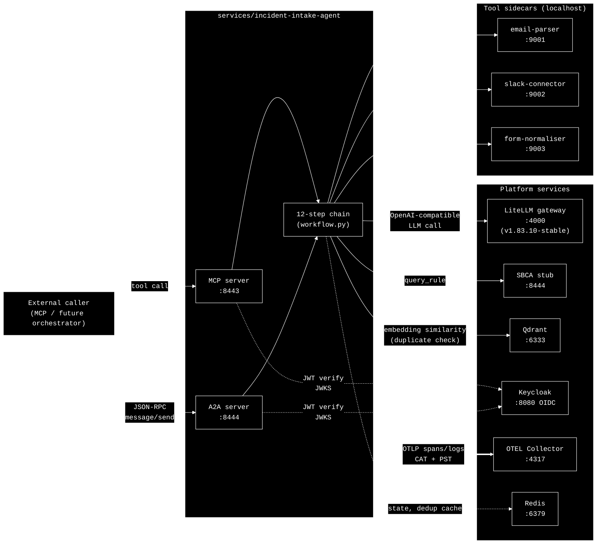
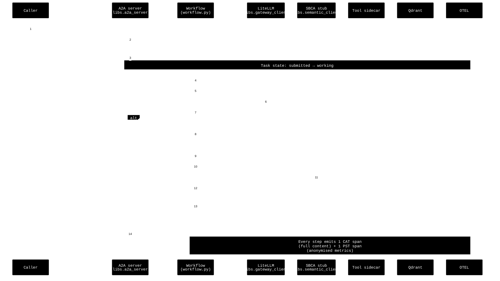
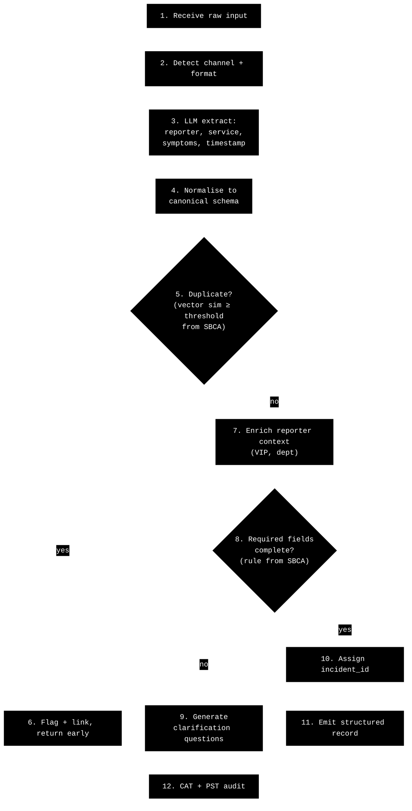
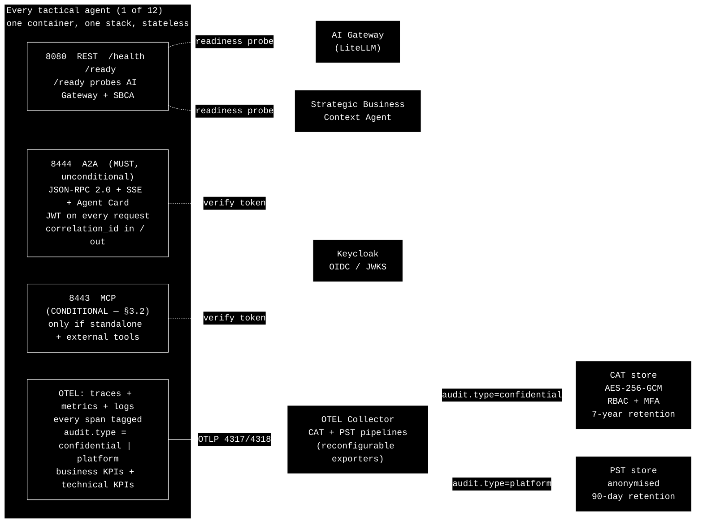

# Architecture — Incident Intake Agent (Build #1)

This document covers **only what you need to understand before code is written**. It is deliberately short. Full per-file design lives inside `services/incident-intake-agent/` once scaffolded.

## What's in scope for this build

The **Incident Intake Agent** plus the minimum shared infrastructure required to run it end-to-end on `docker compose up`:

- `services/incident-intake-agent/` — the agent itself
- `libs/a2a_server`, `libs/gateway_client`, `libs/semantic_client`, `libs/observability`, `libs/config_loader` — the shared packages it imports (built only as thin as this agent needs)
- `tools/email-parser`, `tools/slack-connector`, `tools/form-normaliser` — the three sidecars from the PRD
- `infra/docker-compose.yaml` — LiteLLM (pinned `v1.83.10-stable`), Qdrant, Keycloak, OTEL Collector, Redis, plus the above
- `configs/semantic-plane/intake-rules.yaml` — duplicate-threshold and required-fields rules, served by a **stubbed** SBCA (a tiny FastAPI that reads the YAML — full SBCA agent comes later)

**Out of scope for this turn:** the other 11 tactical agents, the 3 sub-process orchestrators, the I2R Primary Orchestrator, the full Strategic Business Context Agent. Everything Incident Intake calls *is mocked or stubbed* if it isn't strictly required for this agent to function. We're proving the framework scaffolding, not the full system.

## Anthropic pattern: prompt chaining

The PRD lists 12 sequential steps for this agent — receive → detect channel → extract → normalise → de-dup → enrich → validate → ID → emit → audit. That's a textbook **prompt chain** (Anthropic, "Building Effective Agents"). Each step's output is the next step's input; gates between steps (duplicate check, completeness check) can short-circuit. No routing, no parallelism, no evaluator loop in this agent — those belong in Diagnostic and the orchestrators.

The `agent.py` module docstring will state `Pattern: prompt chaining (Anthropic)` so the compliance reviewer can confirm it.

## Diagrams

### 1. Where this agent sits in the SmartOps stack (this-build scope)

**What to notice:** every external dependency the agent has is either a sidecar tool (HTTP localhost) or a platform service (HTTP on the internal Compose network). The agent never holds Azure keys — LiteLLM does. It never reads YAML business rules directly — SBCA does. Keycloak issues JWTs that both ingress paths verify. OTEL receives everything tagged `audit.type` = `confidential` or `platform`.

### 2. Request lifecycle (A2A happy path)

**What to notice:** the A2A layer owns transport, auth, and task lifecycle; `workflow.py` owns business steps and never talks JSON-RPC itself. Every step is observable in both CAT (for compliance) and PST (for ops dashboards) — that classification is enforced by `libs.observability`, not by the agent author.

### 3. The 12-step chain (mapped to PRD)

**What to notice:** Steps 1–2 are pure tool calls (no LLM). Step 3 is the only mandatory LLM call. Steps 5 and 8 are the **decision gates** that read from SBCA — both thresholds are configuration, never code. Steps 6 and 9 are the two short-circuit exits. Step 12 always runs.

## Cross-cutting invariants — applied to all 12 tactical agents

Per [docs/DI_AI_FRAMEWORK.md](docs/DI_AI_FRAMEWORK.md) §3.1 (A2A), §6 (observability), §12.2 (per-project compliance checklist), the following are **MUST** on every tactical agent — Incident Intake is just the first instance. They are gated at deployment by `/compliance-check` applying the §12.1 FAIL_COUNT formula: *one MUST failure or three SHOULD failures blocks deployment*.

The verbatim §12.2 MUSTs that every agent's CI/compose build is gated on:

- **Protocols** — A2A on 8444; MCP on 8443 only if standalone + external tools; REST/gRPC for service integration.
- **AI Gateway** — every LLM call through the gateway; no provider keys in the agent; token usage tracked.
- **Observability** — OTEL instrumentation active; distributed tracing with correlation IDs; `/health` + `/ready`; business + technical KPIs tracked; reconfigurable exporters (no code changes to swap targets).
- **Audit** — CAT implemented + AES-256-GCM encrypted; PST implemented + anonymised; **every log/span classified** as exactly one of `audit.type = "confidential"` or `"platform"` — mixing is a MUST failure.
- **Security** — OAuth2/JWT at every boundary; RBAC via OIDC claims; no hardcoded secrets; TLS 1.3 in transit, AES-256-GCM at rest.
- **Semantic plane** — business rules queried from SBCA; no hardcoded thresholds; capability advertised to the registry.
- **Tool isolation** — tools in separate containers, accessed via network, versioned and deployed independently.
- **Architecture** — single function per container, single stack, resource limits set, stateless, layer classification in README.
- **EU AI Act** — risk classification documented; if high-risk, human oversight + bias detection + FRIA.

How this is enforced (no more, no less than the framework asks):

1. **At scaffold time** — [/new-tactical-agent](.claude/commands/new-tactical-agent.md) bakes all of the above into the generated files, so the default is compliant.
2. **At code-review time** — the [framework-compliance-reviewer](.claude/agents/framework-compliance-reviewer.md) subagent maps its rules A–M directly to the §12.2 checklist.
3. **At deployment time** — [/compliance-check](.claude/commands/compliance-check.md) applies the §12.1 verdict formula (`FAIL_COUNT ≥ 1 OR WARN_COUNT ≥ 3 → FAIL`) and blocks the merge/deploy. This is the gate the framework actually specifies.

The PostToolUse hook only blocks forbidden patterns (direct LLM SDKs, third-party A2A wrappers, hardcoded thresholds, bad LiteLLM tags) because that's all the framework requires at edit time — it does *not* mandate absence-checks on every write. Gating happens at the compliance-check step.

## Plan evaluation — gaps closed before code (framework re-check)

After re-reading [docs/DI_AI_FRAMEWORK.md](docs/DI_AI_FRAMEWORK.md) §§3–9 with the build plan side-by-side, these gaps are closed by the spec below. They apply to **all 12 tactical agents**, not just Intake.

### A2A envelope contract (§3.1) — mapping framework fields to Google A2A

The framework MUSTs (capability name, inputs, business context, correlation ID; response status incl. `success | failure | requires_human`) are not native Google A2A fields. They MUST live inside A2A's spec-standard slots so we don't fork the spec.

| Framework MUST | Carried in (Google A2A) |
|---|---|
| capability name | `Message.metadata.di.capability` (string, e.g. `incident_intake`) |
| inputs | `Message.parts` (TextPart / DataPart / FilePart per spec) |
| business context (process, step) | `Message.metadata.di.process` + `Message.metadata.di.step`; `contextId` reused across messages of the same business process |
| correlation ID | `Message.metadata.di.correlation_id` and `taskId`; `traceparent` (W3C) propagated to OTEL |
| status: `success` | A2A Task state `completed` |
| status: `failure` | A2A Task state `failed` |
| status: `requires_human` | A2A Task state `input-required` with `Message.metadata.di.requires_human = true` and a human-readable `reason` |
| metadata: duration, confidence | `Task.metadata.di.duration_ms`, `Task.metadata.di.confidence` |

This is implemented once in `libs/a2a_server` and `libs/a2a_client`. Agent code never touches the JSON-RPC envelope directly.

### Correlation ID propagation (§3.1, §6.1)

- Minted in `libs/a2a_server` when an incoming `message/send` lacks one; otherwise reused.
- Stored in OTEL baggage + every span attribute as `di.correlation_id`.
- Re-emitted to every downstream call: `libs/gateway_client` adds it as `X-Correlation-Id`; `libs/semantic_client` adds it to A2A metadata; sidecar HTTP calls receive it as `X-Correlation-Id`.
- W3C `traceparent` is propagated alongside it so distributed tracing works without translation.

### Gateway auth + per-agent token metering (§4.3)

LiteLLM is configured to **verify Keycloak JWTs directly** (JWT auth mode, JWKS from Keycloak). Each agent presents its own service-account access token issued to `agent-<name>` client. Per-agent token metering uses LiteLLM's team/key mechanism keyed by the JWT `azp` (authorised party) claim, so usage is attributed to the right agent without us minting separate virtual keys. No provider keys ever leave the LiteLLM container.

### Capability Registry — minimum Phase-1 behavior (§5.1)

For Phase 1 the **SBCA stub also serves the Capability Registry endpoint**:

- On startup, each agent calls `capability_registry/register` over A2A with: capability name, A2A URL (Agent Card URL), version, advertised skills.
- On shutdown, deregisters.
- Orchestrators discover by capability name, not hostname. Even though we have no orchestrators in this build, the registration path is exercised so it doesn't drift.

### Business + technical KPIs for Incident Intake (§6.5)

Enumerated up-front so they ship with the agent, not retro-fitted:

- **Business KPIs** (CAT-routed): incident-emit rate, duplicate-detection rate, completeness rate (% incidents emitted without clarification), VIP-incident count, time-to-emit (p50/p95), clarification-question rate.
- **Technical KPIs** (PST-routed): A2A request latency (p50/p95/p99), LLM token consumption per request, tool sidecar latency per tool, error rate per step, OTEL pipeline drop rate.

Both sets are emitted from `libs/observability` via OTEL Metrics; the audit-type tag determines which pipeline they land in.

### EU AI Act preliminary classification (§9)

**Incident Intake Agent: NOT classified as High-Risk under Annex III.** Reasoning: it processes IT operations data, performs entity extraction and routing within an internal IT service workflow; it does not make decisions in employment, education, biometrics, critical infrastructure, justice, or migration domains. It is therefore subject to general-purpose AI transparency obligations (logging, audit trail) but does not trigger Article 6 high-risk requirements. CAT logging + correlation IDs + decision-chain capture in step 11 satisfy transparency. A full assessment ships in `services/incident-intake-agent/docs/eu-ai-act-risk-assessment.md` with the build.

The **Automated Fix Agent** (future) is the project's likely Annex III high-risk candidate (autonomous infrastructure changes); Intake is not.

### Anthropic terminology vs framework terminology

In Anthropic's "Building Effective Agents", Incident Intake is a **workflow** (predetermined prompt chain with deterministic gates), not an "agent" (LLM-driven control flow). The DI framework's "tactical agent" terminology covers both. The `agent.py` module docstring will state `Anthropic pattern: prompt chaining (workflow, not autonomous agent)` so the distinction is recorded.

The only agent in this project that meets Anthropic's stricter "agent" definition is the Diagnostic Agent (evaluator-optimizer loop with model-chosen iterations).

### Internal-step resilience policy (closes an unstated gap)

The framework requires Saga compensation on **strategic orchestrators**, not on tactical agents. But tactical agents still need a written failure policy or behaviour will drift across the 12 agents:

- **Tool sidecar failure** in steps 1–2 or 7: retry 3× with exponential backoff (in `libs/gateway_client`'s sibling HTTP helper). If still failing, emit `Task` state `failed` with `Message.metadata.di.failed_step = N` and the upstream error. CAT logs full error; PST logs the step + error class only.
- **LLM call failure** in step 3: same retry policy via LiteLLM circuit breaker; on exhaustion → `failed`.
- **SBCA failure** in steps 5/8: hard fail (do **not** apply hardcoded fallback thresholds — that's a §5 violation). Return `failed`, log CAT, alert via PST metric.
- **Validation incomplete** (step 8 = no): not a failure — emit Task `input-required` per the §3.1 mapping above.

## Open decisions I need before writing code

These are small but they change file contents:

1. **uv workspace vs per-service venvs.** Recommended: uv workspace with `libs/*` and `services/incident-intake-agent` as workspace members. Single `uv.lock`.
2. **Keycloak realm + client_id convention.** Recommended: `smartops` realm; per-agent clients named `agent-<kebab-name>` (e.g. `agent-incident-intake`); audience claim equals client_id; gateway verifies `aud` matches the calling agent.
3. **Gateway auth model.** Recommended: LiteLLM verifies Keycloak JWTs (JWT auth mode, JWKS from `http://keycloak:8080/realms/smartops/protocol/openid-connect/certs`); per-agent metering keyed on `azp` claim. **No** LiteLLM virtual keys, **no** raw provider keys. Confirm this is your preference vs the virtual-key model.
4. **OTEL exporter targets.** Local-only stack — CAT → `cat-store` container (filesystem JSONL sink, AES-256-GCM at rest, gitignored); PST → local OTLP → stdout exporter. Real Elasticsearch / vault wiring is Phase 2+. Reconfigurable via `infra/otel/collector-config.yaml`.
5. **Vector model for duplicate detection.** I'll route embeddings through LiteLLM to an Azure Foundry embedding deployment (e.g. `text-embedding-3-large`). Confirm a Foundry **embedding** deployment exists alongside chat.
6. **MCP exposure scope.** PRD says yes (`submit_incident`, `check_duplicate`). Confirm we ship both MCP tools in this build, or just A2A first and add MCP later.
7. **A2A metadata namespace.** I'll use `di.*` as the prefix inside `Message.metadata` / `Task.metadata` (e.g. `di.capability`, `di.correlation_id`, `di.requires_human`). Avoids colliding with future spec additions. OK?
8. **Capability Registry collocated with SBCA stub for Phase 1.** Same FastAPI process, separate A2A skill (`capability_registry/register`, `…/lookup`). When SBCA is fully built later, the Capability Registry can split out without breaking callers. OK?
9. **EU AI Act preliminary read.** I've classified Incident Intake as **NOT high-risk** under Annex III (rationale in the section above). The full risk-assessment doc still ships with the build per §9. Confirm or push back.

## What you'll be able to do once this build is done

- `docker compose up` brings the full stack live.
- `curl http://localhost:8444/.well-known/agent-card.json` returns a valid A2A Agent Card.
- A scripted A2A `message/send` with a sample email payload runs the full 12-step chain, hits LiteLLM and Qdrant, queries the SBCA stub, and returns a Task in state `completed` with a structured incident artifact.
- OTEL Collector logs show CAT and PST spans on separate pipelines.
- `/compliance-check` returns PASS.

If the diagrams render the way you want and the five open decisions are answered, I'll start scaffolding from `libs/` outward.
